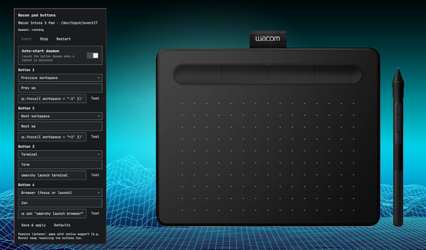

# Wacom Support for Omarchy



Map your Wacom tablet's pad buttons to anything — workspace switches, app
launchers, screenshots, custom commands — everywhere *outside* the apps that
already handle them natively (like Rnote).

- Bar widget (`✎`) that **hides itself when no Wacom tablet is connected**
  (hotplug supported, polled every 4 s).
- Click the widget for a panel: tablet status, daemon start/stop, and one
  command field per button with presets.
- Passive listener: the daemon never grabs the device, so Rnote & co. keep
  receiving the buttons natively.
- Defaults: buttons 1 → 4 switch to workspaces 1 → 4 on Hyprland
  (Lua dispatcher syntax, see below).
- Legacy-proof: pre-0.55 `hyprctl dispatch …` commands saved earlier are
  translated automatically, and every failure is logged (no more silent
  no-ops) — see `scripts/wacom-ctl logs`.

## Hyprland ≥ 0.55 (Lua dispatchers)

Since Hyprland 0.55, `hyprctl dispatch <name> <arg>` is rejected — actions
must be single quoted Lua expressions:

```sh
hyprctl dispatch 'hl.dsp.focus({ workspace = "2" })'
```

Relative cycling uses the bare `+1` / `-1` selectors (verified working;
`e±1` / `m±1` silently no-op through `hyprctl` on 0.56):

```sh
hyprctl dispatch 'hl.dsp.focus({ workspace = "+1" })'
```

The presets and defaults already use this form. If you kept an old mapping
(e.g. `hyprctl dispatch workspace 2`), the daemon translates it on the fly
and notes it in the log.

## Requirements

- Omarchy Quattro (shell plugin host)
- A Wacom tablet (tested: Intuos S CTL-4100, 4 buttons = `BTN_0..BTN_3`)
- `python3` (stdlib only — no pip packages), `hyprctl` for the defaults
- Your user must be able to read `/dev/input/event*` (you are if in the
  `input` group: `groups | grep input`)

## Install

```sh
omarchy plugin add https://github.com/godisopensource/omarchy-wacom-support.git --enable
```

Then place the widget (defaults to the right section) and reload:

```sh
omarchy bar move io.github.godisopensource.omarchy-wacom-support --section right
omarchy-shell shell rescanPlugins
```

No sudo, no install hooks — the widget auto-starts its user-level daemon
when a tablet is detected (toggleable in the panel).

## Usage

1. Plug in the tablet → the `✎` widget appears in the bar.
2. Click it → assign each button a command, either from the preset
   dropdown (workspaces, scratchpad, Omarchy menu, browser, terminal,
   screenshot…) or any custom shell command, e.g. `omarchy launch spotify`.
3. **Save & apply** — the daemon restarts and the mapping is live.
4. **Test** runs a button's command immediately without touching the tablet.

Tip: for apps, prefer focus-or-launch so repeated presses focus the
existing window instead of piling up new ones, e.g.
`omarchy launch or focus zen "omarchy launch browser"` (this also avoids
Zen's double window on cold start counting against you).

Settings live in the widget entry in `~/.config/omarchy/shell.json`
(keys `button1..4`, `label1..4`, `autoStart`).

### CLI

All scripts live in `scripts/` and work without the bar too:

```sh
scripts/wacom-ctl status        # tablet + daemon + effective mapping
scripts/wacom-ctl start|stop|restart
scripts/wacom-ctl probe         # list pad devices and their buttons
scripts/wacom-ctl test 2        # run button 2's command now
scripts/wacom-ctl logs          # daemon log
scripts/wacom-ctl config        # effective mapping and its source
python3 scripts/wacom-daemon.py --dump-events  # debug: raw pad events
```

### Manual override

If you run without the bar widget, create
`~/.config/omarchy-wacom-support/buttons.json`:

```json
{
  "button1": "hyprctl dispatch workspace 1",
  "button2": "hyprctl dispatch workspace 2",
  "button3": "hyprctl dispatch workspace 3",
  "button4": "hyprctl dispatch workspace 4"
}
```

This file takes precedence over `shell.json` when present.

## How it works

`scripts/wacom-daemon.py` finds `Wacom … Pad` nodes in
`/proc/bus/input/devices`, reads `struct input_event` frames with pure
Python, and on `EV_KEY` press of `BTN_0..BTN_3` spawns the mapped command
detached (`start_new_session`). No exclusive grab, no root, hotplug
re-scan every 2 s, per-button 250 ms debounce. PID file in
`$XDG_RUNTIME_DIR`, log in `$XDG_STATE_HOME/omarchy-wacom-support/`.

## Remove

```sh
scripts/wacom-ctl stop
omarchy plugin remove io.github.godisopensource.omarchy-wacom-support
```

## Troubleshooting

- Widget never appears: `scripts/wacom-status --json` should show
  `"present": true`. Check cable, `libwacom-list-local-devices`, and group
  membership (`groups | grep input`, re-login after changes).
- Button does nothing: `scripts/wacom-ctl config` shows the effective
  mapping and source; `scripts/wacom-ctl logs` shows presses and spawns;
  `--dump-events` verifies the kernel sees the press.
- A press both switches workspace *and* does something in Rnote: expected —
  the listener is passive by design. Leave that button unmapped if you
  prefer the in-app behavior.
- Daemon won't stay up: check the log path printed by `wacom-ctl start`.

## Development / publishing

Manifest follows the [Omarchy plugin guide](https://plugins.omarchy.org/develop.html)
(`bar-widget` kind, `manifest.json` at repo root).

```sh
./tests/run.sh                        # syntax + status + mapping checks
omarchy plugin validate /path/to/this/repo
```
